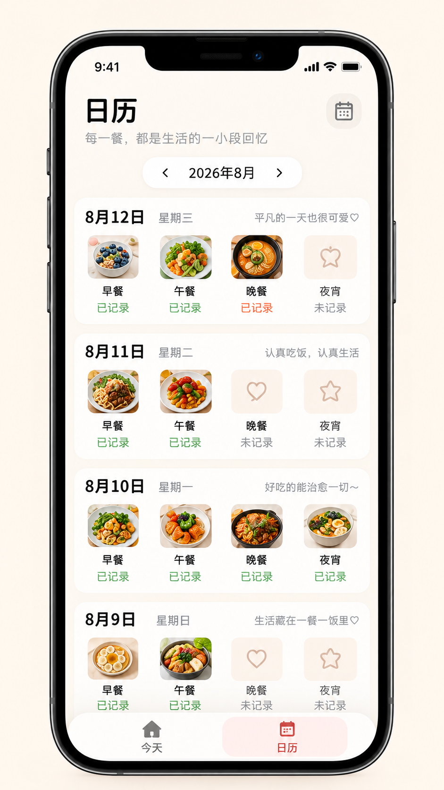
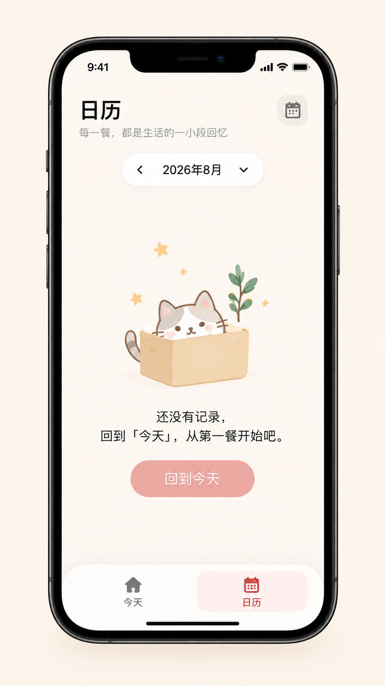

# 日历页视觉重构基准

状态：已确认的视觉方向  
适用页面：`pages/calendar/index`  
参考图：

1. [有记录状态](./assets/calendar-recorded-reference.png)
2. [无记录状态](./assets/calendar-empty-reference.png)

## 1. 使用方式

两张图共同定义日历页的主要视觉状态。月份导航、日期内容卡、空状态和底部导航应保持同一套温暖、克制的手账视觉语言。

参考图只定义视觉和交互入口。历史日期选择、餐食记录归属、历史补记、进入餐食详情和每日回顾等行为，以当前代码、测试及 `CONTEXT.md` 为准。

## 2. 边界

- 手机外框、刘海和系统状态栏不是小程序需要绘制的内容。
- 图中的月份、日期、餐食图片、记录状态和每日文案均为示例，必须由真实页面状态驱动。
- 日历只允许选择今天及历史日期的现有约束不得因月份控件的视觉重构而改变。
- 猫咪、树枝、爱心和星星属于插画方向；没有合法原始资产时，应使用项目自有资产或同气质实现，不从参考图裁切。

## 3. 共用页面结构

1. 页头：左侧为大标题「日历」及灰色副标题，右侧为浅底圆角日历图标。
2. 月份导航：居中胶囊容器，显示上一个月、当前年月及下一个月/展开入口。
3. 主内容：根据所选月份是否存在记录，在记录列表和空状态之间切换。
4. 底部导航：与首页共用同一悬浮导航组件；日历项使用浅粉底和红色图标/文字。

## 4. 有记录状态

- 日期按新到旧纵向排列，每天使用独立白色大圆角卡片。
- 卡片顶部显示日期、星期和右对齐的轻量日记文案。
- 卡片主体固定展示早餐、午餐、晚餐、夜宵四个餐次，保持四列对齐。
- 已记录餐次显示方形圆角缩略图、餐次名和绿色/点缀色的「已记录」。未记录餐次显示浅暖色占位插画、餐次名和灰色「未记录」。
- 点击已记录餐次进入详情；点击历史日期的未记录餐次继续支持补记。
- 列表可纵向滚动，底部内容不得被导航遮挡。

## 5. 无记录状态

- 保留完整页头、月份导航和底部导航，不显示空白日期卡。
- 内容区中心展示轻量猫咪插画、说明文字和主要按钮「回到今天」。
- 点击按钮应切回今天页；如果当前产品采用页面导航，应避免仅更改视觉选中态而没有真正切换页面。
- 空状态需在不同屏幕高度上保持视觉居中，同时避免与月份导航或底部导航重叠。

## 6. 视觉与响应式要求

- 页面背景使用暖白色；内容卡使用白色或近白色，并配合非常轻的暖色阴影。
- 主文字接近黑色，副标题和未记录状态使用中性灰；成功状态使用柔和绿色，当前导航使用珊瑚红。
- 日期卡、月份胶囊、图标容器和底部导航使用统一的大圆角体系。
- 窄屏优先压缩四列间距和缩略图尺寸，四个餐次仍需同排且标签可读。
- 所有可点击图标、缩略图和导航项应满足移动端触控尺寸并提供按下态。

## 7. 重构验收清单

- [ ] 有记录和无记录两种状态均与参考图保持相同的信息层级。
- [ ] 日期列表按真实数据渲染，四个餐次顺序固定且状态准确。
- [ ] 历史空餐次仍可补记，已有记录仍可进入详情。
- [ ] 月份切换不会允许选择未来日期，也不会改变餐食记录归属。
- [ ] 空状态按钮能正确回到今天。
- [ ] 底部导航与首页的尺寸、圆角、选中态和安全区处理一致。
- [ ] 在窄屏和大屏设备上完成截图对比，列表与空状态均不被遮挡。
- [ ] `npm test` 与 `npm run check` 继续通过。

## 8. 参考资产记录

- 有记录：`spec/ui/assets/calendar-recorded-reference.png`，`941 × 1672`，SHA-256 `68144B1C087988DA8384C25AE17760D3AABD2444EF0AD8F37D5F2DCDB9D0B91D`
- 无记录：`spec/ui/assets/calendar-empty-reference.png`，`941 × 1672`，SHA-256 `29C49586CCB99B8264697339EE9E2939AF43349CCAD5E6A43ADF1A701240B70A`
- 记录日期：2026-09-10

