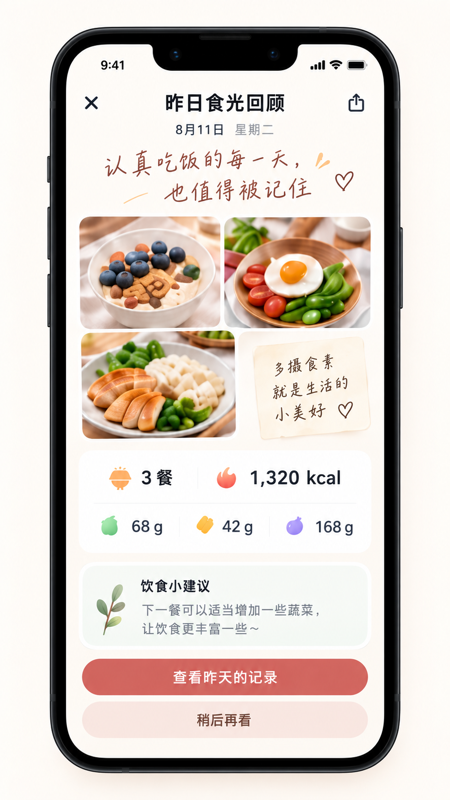

# 每日回顾页视觉重构基准

状态：已确认的视觉方向  
适用页面：`pages/recap/index`  
参考图：[昨日食光回顾 UI 设计图](./assets/daily-recap-reference.png)

## 1. 使用方式

这张图定义每日回顾页后续重构的视觉基准。页面应像一张温暖的日记总结卡，突出餐食照片拼贴、当日汇总和中性饮食提示，不引入连续打卡、评分或压力性表达。

图中的日期、照片、餐数、热量、营养值和文案均为示例，必须由指定日期的真实记录与当前汇总逻辑生成。

## 2. 页面结构

1. 顶部操作：左侧关闭，居中显示回顾标题与日期；右侧分享图标仅作为视觉提案。
2. 情绪文案：使用手写感大字、爱心和少量笔触装饰，作为页面的情绪主标题。
3. 照片拼贴：根据当日餐食记录数量组成圆角拼贴，并可加入一张手写便签作为视觉补位。
4. 当日汇总卡：突出记录餐数与估算总热量，下方展示蛋白质、脂肪和碳水汇总。
5. 饮食提示卡：以植物插画配合温和、可选的下一餐建议。
6. 页面操作：主按钮进入该日期的记录，次按钮关闭自动回顾或稍后再看。

## 3. 回顾内容与行为

- 页面只在所选日期至少有一条餐食记录时展示；无记录时沿用当前返回行为或进入明确空状态。
- 拼贴图片使用风格化照片，尚未生成时回退到原始照片；点击照片继续支持进入对应餐食详情。
- 拼贴布局应适配 `1–4` 条记录，不能只为参考图中的三餐写死。
- 汇总只统计已有营养分析的餐食，并说明已分析餐数与已人工确认餐数。
- 饮食提示只依据用户主动确认的食物类别，是温和建议，不是健康评分、营养达标结论或医疗建议。
- 自动打开的昨日回顾关闭后，当天不再自动打扰；用户仍可从首页或日历再次查看。

## 4. 操作边界

- 「查看昨天的记录」在非昨日回顾场景应根据实际日期生成文案，例如「查看这天的记录」。
- 「稍后再看」对应关闭当前自动回顾；不得删除、隐藏或修改当天餐食记录。
- 分享图标不代表分享能力已经实现。只有在产品确认分享范围、隐私提示及小程序能力后才能启用，否则应隐藏或展示为不可操作的视觉占位。
- 关闭动作需区分自动回顾和普通进入场景，保留当前 `reLaunch`/返回语义。

## 5. 视觉与响应式要求

- 暖白背景、深色主文字、灰色辅助文字；珊瑚红用于主要按钮和热量点缀，橙、绿、黄、紫用于汇总图标。
- 照片拼贴、汇总卡、提示卡和按钮使用统一的大圆角体系及轻柔暖色阴影。
- 手写文案负责情绪表达，汇总数字仍使用清晰的系统字体。
- 窄屏下拼贴比例可以调整，但图片不可严重变形，便签文字不可溢出。
- 页面内容超出高度时允许滚动，主要和次要按钮必须保持可访问并避开安全区域。

## 6. 重构验收清单

- [ ] 页面层级与参考图一致，并保持温暖、非评判性的表达。
- [ ] 拼贴正确适配 `1–4` 条真实记录，点击图片可进入详情。
- [ ] 汇总只包含已有营养分析的餐食，示例值没有被写死。
- [ ] 饮食提示仍遵守非医疗、非评分和只依据主动确认数据的边界。
- [ ] 自动回顾关闭后当天不再重复自动展示，但仍可手动打开。
- [ ] 未实现的分享能力没有被误导性地开放。
- [ ] 不同日期进入时，标题和按钮文案不会固定写成「昨日」。
- [ ] 窄屏和大屏下拼贴、卡片和按钮均完整可访问。
- [ ] `npm test` 与 `npm run check` 继续通过。

## 7. 参考资产记录

- 文件：`spec/ui/assets/daily-recap-reference.png`
- 原始尺寸：`941 × 1672`
- SHA-256：`801404A7A0B2673D5F5C8FC49C9DD357D85226D5715AE8BBCD5C4188EA344B02`
- 记录日期：2026-09-10

