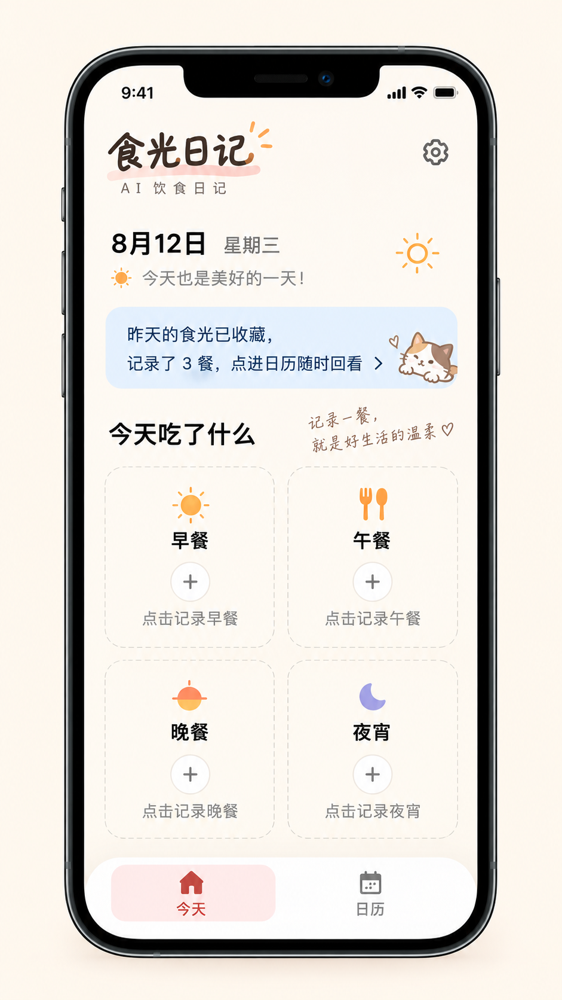
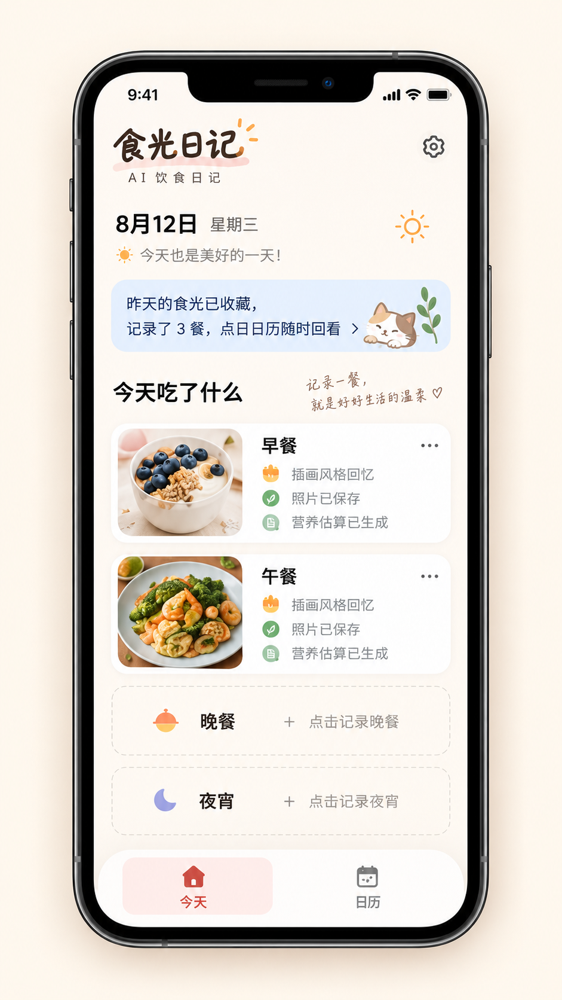

# 首页「今天」视觉重构基准

状态：已确认的视觉方向  
适用页面：`pages/home/index`  
参考图：

1. [空餐次状态](./assets/home-today-reference.png)
2. [部分餐次已记录状态](./assets/home-today-recorded-reference.png)

## 1. 使用方式

这两张图共同构成首页「今天」视图后续重构的视觉基准。重构时，页面的信息层级、布局关系、色彩、圆角、留白、图标气质和整体温暖感应优先向参考图对齐。

参考图只定义视觉和交互入口，不替代现有业务规则。餐食记录、图片持久化、处理任务状态、失败重试、人工确认、历史补记和每日回顾等行为，以当前代码、测试及 `CONTEXT.md` 中的定义为准。

## 2. 边界

- 本基准只覆盖首页的「今天」状态，不直接定义日历、详情、设置和每日回顾页面。
- 手机外框、刘海和系统状态栏属于展示载体，不是小程序需要绘制的 UI。
- 页面应适配真实设备安全区域，不以参考图中的固定像素或单一机型尺寸实现。
- 图中的日期、星期、天气、餐数和文案是示例内容，实际显示必须来自页面状态。
- 图中的猫咪、手写字和图标表达的是插画气质；若没有可合法使用的原始资产，应使用项目自有资产或同气质实现，不直接从参考图裁切。

## 3. 页面结构

从上到下保持以下顺序：

1. 品牌区：手写感「食光日记」主标识、粉色笔触下划线和较克制的「AI 饮食日记」副标题；设置入口位于右侧。
2. 日期与天气区：日期为主要信息，星期为次要信息；下一行是天气图标与一句温和的问候，右侧保留较大的天气图标。
3. 昨日回顾卡：浅蓝色大圆角横向卡片，展示昨日记录餐数、查看提示、右箭头及轻量猫咪插画。
4. 今日记录标题：左侧为「今天吃了什么」，右侧可放手写风格的情绪文案。
5. 餐次卡位网格：早餐、午餐、晚餐、夜宵按 `2 × 2` 排列。每个空卡位含餐次图标、餐次名称、圆形加号和「点击记录…」提示。
6. 底部导航：悬浮白色圆角容器，包含「今天」与「日历」两个等宽入口；当前项使用浅粉底和红色图标/文字。

## 4. 视觉语言

- 整体：温暖、安静、轻手账感；大面积暖白背景，避免当前版本中高饱和黄色成为主色。
- 主文字：接近黑色，标题粗而清晰；辅助文字使用中性灰。
- 点缀色：日光橙、珊瑚红、柔和粉、浅天蓝和夜宵紫，仅用于图标、选中态及少量插画。
- 容器：大圆角、弱边界、少阴影。空餐次卡使用浅灰虚线边框；昨日回顾使用浅蓝渐变或非常柔和的蓝色底。
- 字体：正文优先使用系统中文字体以保证可读性；品牌名和情绪文案可使用有授权的手写字体或自制图形资产。
- 图标：线条圆润、形状简洁；四个餐次图标需在尺寸和视觉重量上保持一致。

可作为首轮实现起点的近似色值（最终以视觉对比为准）：

| 用途 | 建议起点 |
| --- | --- |
| 页面背景 | `#FFFAF4` |
| 主文字 | `#151515` |
| 次要文字 | `#777777` |
| 日光橙 | `#FFA13D` |
| 当前导航红 | `#D94B43` |
| 当前导航浅粉底 | `#FDE9E7` |
| 昨日回顾浅蓝 | `#E4F1FF` |
| 空卡边框 | `#D5D2CE` |

## 5. 响应式与状态要求

- 窄屏仍保持双列卡位；优先缩小列间距和卡内留白，不压缩文字到不可读。
- 页面内容超出可视高度时允许纵向滚动，底部导航不得遮挡最后一排卡位。
- 空卡位遵循参考图；已有记录的卡位沿用同一网格尺寸，并在其中呈现餐食图片、处理状态和进入详情的入口。
- 当出现已有记录的餐次时，布局从全空状态的 `2 × 2` 大卡网格切换为纵向混合列表：已记录餐次使用图片信息卡，未记录餐次使用紧凑虚线行。餐次顺序始终为早餐、午餐、晚餐、夜宵。
- 已记录卡左侧显示方形圆角餐食图片，右侧依次显示餐次名称和处理结果摘要；更多操作位于右上角，整卡仍可进入详情。
- `processing`、`failed`、已生成结果和本地模拟等现有状态都必须有清晰但不过度抢眼的视觉表达。
- 昨日无记录时可隐藏昨日回顾卡，但后续内容应自然上移，不保留空白占位。
- 所有可点击区域应满足移动端触控尺寸，并提供按下态；文字与背景需保持可读对比度。

## 6. 重构验收清单

- [ ] 页面层级和模块顺序与参考图一致。
- [ ] 空餐次卡为 `2 × 2` 网格，信息和交互入口齐全。
- [ ] 暖白、浅蓝、浅粉和橙色构成主要视觉基调，没有大面积高饱和黄。
- [ ] 底部导航的悬浮容器、当前项选中态及安全区处理与参考图一致。
- [ ] 日期、天气、昨日餐数等示例值均已替换为真实状态或明确的产品占位逻辑。
- [ ] 已有记录、处理中、失败和完成状态未因视觉重构丢失。
- [ ] 在至少一个窄屏和一个大屏设备上完成截图对比，且底部内容不被遮挡。
- [ ] `npm test` 与 `npm run check` 继续通过。

## 7. 参考资产记录

- 空餐次：`spec/ui/assets/home-today-reference.png`，`941 × 1672`，SHA-256 `D7383052787D72CC46B30DF88EFE72F3B03734E3D2605CD2A9D6FC90198AD7BE`
- 部分餐次已记录：`spec/ui/assets/home-today-recorded-reference.png`，`941 × 1672`，SHA-256 `DA791F608A3F76E74AE6DF4212CA44CFD6D1B15853C6C49FE27AA8BB966714B8`
- 记录日期：2026-09-10
