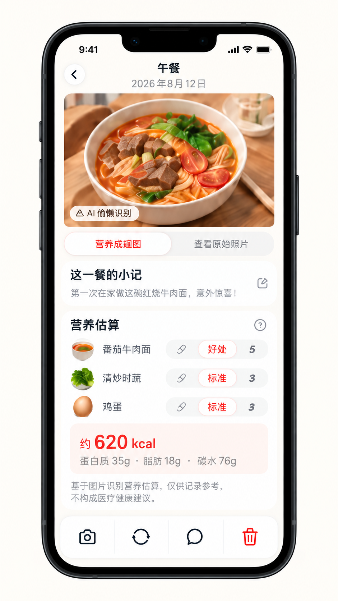

# 餐食详情页视觉重构基准

状态：已确认的视觉方向  
适用页面：`pages/detail/index`  
参考图：[餐食详情页 UI 设计图](./assets/meal-detail-reference.png)

## 1. 使用方式

这张图定义餐食详情页后续重构的视觉基准。页面应突出餐食图片和这一餐的记忆，同时保留营养估算、份量人工确认以及记录管理能力。

参考图中的餐食名称、图片、日期、笔记和营养数值均为示例。真实内容必须来自当前餐食记录；营养结果始终是估算，不得表达为诊断或精确测量。

## 2. 页面结构

1. 顶部导航：左侧返回按钮，居中显示餐次名称与记录日期。
2. 主图：大幅横向圆角图片，默认展示已完成的风格化照片；图片左下角可显示 AI 识别/模拟状态标签。
3. 图片切换：紧贴主图下方的双段控件，用于切换风格化照片与原始照片。
4. 餐食小记：白色圆角卡片，展示短笔记并提供明确编辑入口。
5. 营养估算：白色圆角卡片，展示识别食物、份量选择、热量、宏量营养素及免责声明。
6. 底部操作栏：悬浮白色圆角容器，集中放置记录级操作并避开设备安全区域。

## 3. 图片与处理状态

- 风格化任务完成时默认展示风格图，并允许切换回原始照片；未完成或失败时应回退显示原始照片。
- `processing`、`failed` 和本地模拟状态必须有清楚但克制的反馈，不得用示例中的「AI 偷懒识别」替代真实状态。
- 重新生成风格图后，旧任务不得回写到已替换或删除的记录。
- 替换照片属于破坏性变更前置操作，必须沿用现有确认、文件清理和失败回滚逻辑。

## 4. 餐食小记

- 默认展示当前笔记；无笔记时提供温和占位文案。
- 编辑入口可使用右侧小图标，但必须具备可理解的触控反馈与无障碍名称。
- 继续遵守当前 `50` 字上限和保存行为。

## 5. 营养估算与人工确认

- 每个识别食物使用一行：左侧可配食物缩略图/图标，中部为名称，右侧为份量选择。
- 份量选项来自真实业务值（少、标准、多），当前项使用浅红描边或浅色底突出。
- 热量作为卡片内的主要汇总数据，蛋白质、脂肪和碳水使用次一级文字。
- 免责声明必须明确营养结果基于图片和份量估算，仅供饮食记录参考，不构成医疗健康建议。
- 已人工确认的结果不得被重试自动覆盖；新结果继续作为候选营养分析，由用户明确采用或保留当前结果。
- 处理中、失败、候选结果和已人工确认状态虽然未出现在参考图中，重构时仍必须提供完整入口和反馈。

## 6. 底部操作

- 至少保留当前已实现的替换照片、重新生成风格图、重新分析营养和删除记录能力。
- 图标只是视觉建议，不能依赖含义不清的图标传达操作；应补充按钮文案、提示或无障碍名称。
- 重新分析营养可作为营养卡片的上下文操作，不要求机械对应参考图中的聊天图标。
- 删除使用红色危险态，并保留二次确认；确认文案应说明原始照片、风格图、营养估算和备注都会被删除。

## 7. 视觉与响应式要求

- 暖白背景、深色主文字和灰色辅助文字；珊瑚红用于选中态、重点营养值与危险操作。
- 主图、信息卡和底部操作栏使用统一的大圆角体系及轻柔阴影。
- 页面可纵向滚动，底部固定操作栏不得遮挡免责声明或营养内容。
- 食物行和份量控件在窄屏下仍需对齐、可读、可点击；必要时缩小间距而不是截断关键数据。

## 8. 重构验收清单

- [ ] 主图、图片切换、小记、营养估算和底部操作的层级与参考图一致。
- [ ] 原始照片与风格化照片可正确切换，未完成时有合理回退。
- [ ] 处理、失败、重试和候选营养分析状态均未丢失。
- [ ] 修改份量后会更新人工确认结果，后续分析不会自动覆盖它。
- [ ] 替换与删除继续执行现有确认、文件清理和失败处理逻辑。
- [ ] 营养免责声明清晰可见，示例数值没有被写死。
- [ ] 窄屏和大屏下内容完整可访问，底部栏正确处理安全区域。
- [ ] `npm test` 与 `npm run check` 继续通过。

## 9. 参考资产记录

- 文件：`spec/ui/assets/meal-detail-reference.png`
- 原始尺寸：`941 × 1672`
- SHA-256：`BF6C78699B2AF0ADA7B98384A265E6633B02F40B08EDFFD4B2A798E8596E879E`
- 记录日期：2026-09-10

