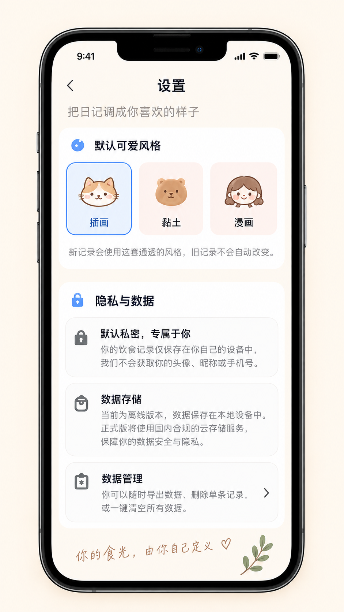

# 设置页视觉重构基准

状态：已确认的视觉方向  
适用页面：`pages/settings/index`  
参考图：[设置页 UI 设计图](./assets/settings-reference.png)

## 1. 使用方式

这张图定义设置页后续重构的视觉基准。重构应保留默认风格选择和隐私说明的现有行为，并使用与首页、日历一致的暖白背景、大圆角卡片及轻插画语言。

图中的产品承诺只是界面示例，不构成已实现能力。关于本地存储、云端服务、数据导出和删除能力的文案，必须与当前真实实现保持一致。

## 2. 页面结构

1. 导航标题：顶部居中显示「设置」，左侧为返回入口。
2. 页面引导：标题下方显示「把日记调成你喜欢的样子」一类简短副标题。
3. 默认风格卡：白色大圆角容器，标题左侧配蓝色小图标；内部横向展示插画、黏土和漫画三种等宽选项。
4. 隐私与数据卡：独立白色大圆角容器，包含默认私密、数据存储和数据管理三项说明。
5. 页尾：使用手写风格情绪文案和植物插画收尾。

## 3. 默认风格选择

- 三种风格均包含代表插画和名称，视觉尺寸与重量保持一致。
- 当前选项使用蓝色描边、浅蓝底和蓝色文字；未选选项使用柔和暖色底。
- 点击选项后立即更新默认风格偏好，并保留现有反馈提示。
- 说明文案必须明确：新记录使用新偏好，旧记录不会自动改变。
- 风格名称和可用项以 `mealService.STYLE_OPTIONS` 的真实数据为准。

## 4. 隐私与数据

- 三个条目使用一致的圆角、边框和内边距，左侧图标、中间标题与说明、右侧可选箭头对齐。
- 纯说明项无需伪装为可点击入口；只有真正可操作的项目显示箭头和按下态。
- 当前版本尚未实现的导出、一键清空或云存储能力，不得通过可点击入口或肯定文案暗示已经可用。
- 隐私弹窗内容应与当前实际存储位置和服务接入状态一致。

## 5. 视觉与响应式要求

- 暖白背景、近黑主文字、中性灰辅助文字；蓝色只用于小节图标和当前风格选中态。
- 大卡片使用白色或近白色、较大圆角和非常轻的阴影；内部条目用浅灰细边界区分。
- 窄屏保持三种风格同排时，可先缩小间距和插画尺寸；名称必须保持可读且不可截断。
- 内容超出高度时允许滚动，页尾插画不能遮挡隐私条目。
- 返回按钮和所有风格选项满足移动端触控尺寸，并提供按下态。

## 6. 重构验收清单

- [ ] 页面结构、卡片层级和视觉基调与参考图一致。
- [ ] 三个风格选项来自真实数据，当前选择清晰且能成功保存。
- [ ] 旧记录不会在切换默认风格后自动改变。
- [ ] 隐私与数据文案只描述已经实现或明确标注为未来能力的功能。
- [ ] 无功能的说明项没有误导性的箭头或点击反馈。
- [ ] 窄屏和大屏下卡片无横向溢出，底部内容可完整访问。
- [ ] `npm test` 与 `npm run check` 继续通过。

## 7. 参考资产记录

- 文件：`spec/ui/assets/settings-reference.png`
- 原始尺寸：`941 × 1672`
- SHA-256：`7B18C48B8EC31AFE1941386E9F2745D1F84A78AD88E7E29FD5618285D5FB03C1`
- 记录日期：2026-09-10

